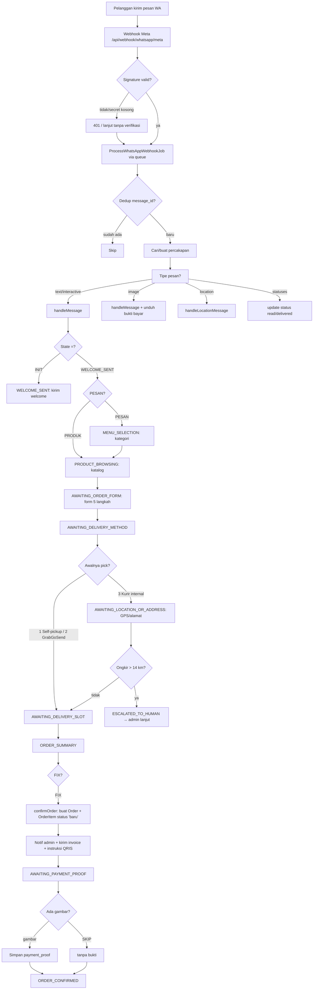

# 🤖 Alur / Use Case Bot Pesanan WhatsApp — Kue Pandan Asli

> Dokumen ini disusun **berdasarkan implementasi nyata di kode** (`app/Services/WhatsApp/OrderBotService.php`, `app/Jobs/ProcessWhatsAppWebhookJob.php`, `app/Http/Controllers/Chatbot/WhatsAppWebhookController.php`, `app/Enums/OrderBotConversationState.php`, `app/Services/WhatsApp/DeliveryZoneService.php`, dst.). Referensi file & baris disertakan agar mudah diverifikasi.
> Stack: Laravel 10 · PHP 8.1+ · Meta WhatsApp Cloud API (Graph API v24.0) · queue database.

---

## 1. Ringkasan

Bot adalah **state machine 13 state** yang menerima pesan WhatsApp pelanggan, memandu pemesanan kue secara bertahap (kategori → produk → form data → metode pengiriman → ongkir → slot waktu → ringkasan → bukti bayar), lalu **membuat record `orders`** (channel `whatsapp`, status `baru`) dan **menotifikasi admin cabang** di dalam sistem.

Alur inti (ringkas):

```
Pelanggan kirim pesan
   ↓
Webhook Meta (3 alias endpoint) → validasi signature → job queue
   ↓
ProcessWhatsAppWebhookJob → dedup → cari/buat percakapan → simpan pesan
   ↓
OrderBotService.handleMessage → cek keyword global (escape hatch) → dispatch sesuai state
   ↓
… state machine berjalan sampai ORDER_SUMMARY → FIX
   ↓
confirmOrder() → buat Customer (bila baru) + Order + OrderItem → status 'baru'
   ↓
Notifikasi admin (AdminNotification) → kirim invoice + instruksi QRIS
   ↓
AWAITING_PAYMENT_PROOF → terima gambar bukti bayar (atau SKIP) → ORDER_CONFIRMED
```

---

## 2. Komponen & File Utama

| Peran | File |
|---|---|
| Endpoint webhook (entry point) | `routes/api.php:21-31` → `app/Http/Controllers/Chatbot/WhatsAppWebhookController.php` |
| Pemrosesan async (queue) | `app/Jobs/ProcessWhatsAppWebhookJob.php` |
| Mesin state bot | `app/Services/WhatsApp/OrderBotService.php` |
| Enumerasi state | `app/Enums/OrderBotConversationState.php` |
| Kirim pesan ke Graph API Meta | `app/Services/WhatsApp/WhatsappMetaService.php` |
| Hitung ongkir & jarak | `app/Services/WhatsApp/DeliveryZoneService.php` |
| Atribusi cabang (region) | `app/Services/WhatsApp/ConversationRegionResolver.php` |
| Notifikasi ke admin | `app/Services/WhatsApp/AdminNotificationRouterService.php` |
| Unduh & kompres bukti bayar | `app/Services/WhatsApp/IncomingMediaHandler.php` |
| Perubahan status order → notif | `app/Observers/OrderObserver.php` |

---

## 3. Entry Point: Webhook

### 3.1 Endpoint (3 alias, semuanya → controller sama)

| Method | URL |
|---|---|
| GET (verifikasi) / POST (event) | `/api/webhook/meta` |
| GET / POST | `/api/webhook/whatsapp/meta` ⭐ (terdaftar di dashboard Meta) |
| GET / POST | `/api/v1/webhook/whatsapp` |

Sumber: `routes/api.php:21-31`.

### 3.2 Verifikasi (handshake GET)

`WhatsAppWebhookController::verify()` (`:13-31`) — bila `hub.mode === 'subscribe'` **dan** `hub_verify_token` cocok dengan config → balas `hub_challenge` (200). Selain itu → **403**.

### 3.3 Menerima event (POST)

`WhatsAppWebhookController::handle()` (`:34-86`):

1. **Validasi signature** (hanya bila `META_WEBHOOK_SECRET` diisi): cek header `X-Hub-Signature-256` = `sha256=` + HMAC-SHA256 dari raw body. Tidak ada / tidak cocok → **401**.
2. Validasi struktur payload: wajib ada `entry[0].changes[0].value`, kalau tidak tetap balas `{"status":"ok"}` (agar Meta tidak retry).
3. **Cek kepemilikan nomor**: ambil `metadata.phone_number_id`; bila bukan milik region manapun dan bukan `META_PHONE_NUMBER_ID` → **403** (`:69-79`).
4. Dispatch `ProcessWhatsAppWebhookJob::dispatch($payload, $phoneNumberId)` lalu balas `{"status":"ok"}` dalam < 5 detik (Meta mewajibkan response cepat).

> ⚠️ Catatan: bisa lebih dari 1 message dalam 1 payload, tetapi controller & job hanya memproses `entry[0].changes[0]`.

---

## 4. Pemrosesan Pesan (Job)

`ProcessWhatsAppWebhookJob` (`implements ShouldQueue`, `tries=3`, `timeout=60`). Alur `processMessage()` (`:77-179`):

1. **Normalisasi nomor** via `Phone::normalize()` (format `62…`).
2. **Dedup**: bila `whatsapp_message_id` sudah ada → skip (`:95-98`).
3. **Cari/buat percakapan** di `whatsapp_conversations`; baru → `current_state = INIT`, region dari `phone_number_id` atau default (`:240-263`).
4. `markAsRead()` ke Meta.
5. **Peta tipe pesan** (`:111-141`):

| Tipe | Konten pesan | Data tambahan |
|---|---|---|
| `text` | `text.body` | — |
| `image` | caption (`[Gambar]` bila kosong) | `media_id` → diunduh & dikompres → `media_path` (via `IncomingMediaHandler::handlePaymentProof()`) |
| `location` | `"Lokasi: {lat}, {lng}"` | `latitude`, `longitude`, `name`, `address` |
| `interactive` | id tombol/list di-normalisasi | — |
| lainnya | `"[{type}]"` | — |

6. Simpan `whatsapp_messages` (`sender_type='customer'`, `status='received'`).
7. `resetConversationIfStale()` — reset bila percakapan diam **> 60 menit** (default `session_expire_minutes`).
8. Increment `message_count`, fire event `WhatsAppMessageReceived`.
9. Routing: `location` → `handleLocationMessage()`; lainnya → `handleMessage()`.
10. **Atribusi cabang** setelah pesan diproses (`regionResolver->apply()`), supaya alamat yang baru dijawab ikut terbaca.

### 4.1 Normalisasi input interaktif (tombol)

`normalizeInteractiveInput()` (`:291-303`):

```
delivery_1 → '1' , delivery_2 → '2' , delivery_3 → '3'
slot_1 → '1' … slot_4 → '4'
cat_tumpeng → 'tumpeng' , cat_hampers → 'hampers' , cat_alacarte → 'ala carte'
```

### 4.2 Status pesan (sent/delivered/read/failed)

`processStatuses()` (`:181-238`) — update/create `whatsapp_message_statuses` (unik per `message_id+status`), perbarui status pesan induk dengan prioritas `sent 0 < delivered 1 < read 2 < failed 3`. Status `failed` juga dipantulkan ke `whatsapp_broadcast_recipients`.

### 4.3 Reset percakapan basi (stale)

`resetConversationIfStale()` (`OrderBotService:217-267`):
- Ambang **60 menit** (config `services.whatsapp.session_expire_minutes`, default 60).
- Berlaku untuk state di tengah alur (termasuk `ORDER_CONFIRMED`).
- Kirim pesan "mari mulai dari awal lagi 😊", clear context, set `WELCOME_SENT`.

---

## 5. State Machine — 13 State

Sumber: `app/Enums/OrderBotConversationState.php`.

| State | Label (terminal) | Keterangan |
|---|---|---|
| `INIT` | Percakapan baru | State awal saat percakapan dibuat |
| `WELCOME_SENT` | Sambutan telah dikirim | Welcome + ajakan PESAN/PRODUK |
| `MENU_SELECTION` | Memilih kategori | Pilih Tumpeng / Hampers / Ala Carte |
| `PRODUCT_BROWSING` | Melihat produk | Lihat katalog / cari produk by keyword |
| `AWAITING_ORDER_FORM` | Menunggu data pesanan | Form 5 langkah |
| `AWAITING_DELIVERY_METHOD` | Menunggu metode pengiriman | 1=Ambil Sendiri · 2=Grab/GoSend · 3=Kurir Internal |
| `AWAITING_LOCATION_OR_ADDRESS` | Menunggu lokasi/alamat | Pin GPS atau alamat teks → hitung ongkir |
| `ESCALATED_TO_HUMAN` | Diteruskan ke admin | Jarak > 14 km; percakapan dilanjutkan admin |
| `AWAITING_DELIVERY_SLOT` | Menunggu slot waktu | 4 slot |
| `ORDER_SUMMARY` | Ringkasan pesanan | Tampil total → `FIX` / `BATAL` |
| `AWAITING_PAYMENT_PROOF` | Menunggu bukti bayar | Kirim gambar QRIS / `SKIP` |
| `ORDER_CONFIRMED` | Pesanan dikonfirmasi | Order tersimpan di DB |
| `CLOSED` | Percakapan ditutup | Ditutup admin via Chat Monitor |

`isActive()` → `false` hanya untuk `CLOSED` dan `ESCALATED_TO_HUMAN` (`:40-43`).

---

## 6. Escape Hatch Global (Keyword Darurat)

Diperiksa **sebelum** state machine (`OrderBotService::checkGlobalEscape()`, `:105-208`). Pencocokan via `str_contains` (substring, case-insensitive).

| Keyword | State asal | Aksi |
|---|---|---|
| `batal`, `cancel`, `batalkan`, `batalin` | 6 state alur + `PRODUCT_BROWSING` | Clear context → `MENU_SELECTION`, "🛑 Pesanan dibatalkan." |
| `menu`, `utama`, `kembali`, `awal`, `back` | 6 state alur | → `MENU_SELECTION`, "📋 Kembali ke menu." |
| `mau pesan`, `pesan`, `order`, `ordering`, `mau order` | 6 state alur | Clear context → `AWAITING_ORDER_FORM`, mulai ulang form |
| `lihat produk`, `produk`, `katalog`, `catalog`, `kategori` | 6 state alur | → `PRODUCT_BROWSING`, kirim katalog |
| `halo`, `hai`, `hi`, `hello`, `salam`, `assalam`, `bantuan`, `help`, `tolong` | 6 state alur | Kirim panduan langkah saat ini (**tanpa** keluar dari state) |
| `mulai ulang`, `mulai dari awal`, `ulang dari awal`, `start ulang`, `restart`, `reset`, `ulangi`, `mulai lagi` | **Semua state** | → `WELCOME_SENT`, status `active` |

> 6 state alur = `AWAITING_ORDER_FORM`, `AWAITING_DELIVERY_METHOD`, `AWAITING_LOCATION_OR_ADDRESS`, `AWAITING_DELIVERY_SLOT`, `ORDER_SUMMARY`, `AWAITING_PAYMENT_PROOF` (`:110-117`).
> ⚠️ Karena pencocokan substring, kata "pesan"/"produk" yang muncul sebagai **isi formulir** (mis. alamat) bisa ditelan sebagai perintah. Ini perilaku nyata dari kode, bukan imajinasi.

---

## 7. Alur Pemesanan End-to-End

### 7.1 `INIT` → `WELCOME_SENT`

`handleInit()` (`:269-273`) — kirim **welcome** (`sendWelcomeMessage`, `:569-588`): sapaan sesuai jam (pagi/siang/sore/malam), nama toko & cabang, `Ketik *PESAN* untuk mulai order, atau ketik *PRODUK* untuk melihat katalog.`, lalu transisi ke `WELCOME_SENT`.

### 7.2 `WELCOME_SENT`

`handleAfterWelcome()` (`:275-292`):

| Input | Aksi |
|---|---|
| `pesan` / `order` / dst. | Kirim list kategori → `MENU_SELECTION` |
| `produk` / `katalog` | Kirim katalog → `PRODUCT_BROWSING` |
| Nama kota (deteksi via `detectCityMention`) | Tanggapan sesuai kota/cabang |
| `halo` / `hai` / dst. | Ulang welcome |
| Lainnya | `sendHelpMessage()` |

### 7.3 `MENU_SELECTION` — 3 kategori (hardcode)

`handleMenuSelection()` (`:294-313`). List message Meta dengan 3 pilihan (`sendProductCategories`, `:590-609`):

| Tombol id | → Intent | Kategori DB |
|---|---|---|
| `cat_tumpeng` | `tumpeng` | "Tumpeng" |
| `cat_hampers` | `hampers` | "Hampers" |
| `cat_alacarte` | `ala carte` | "Produk" |

Dipilih → kirim daftar produk kategori tsb → `setContext('selected_category', …)` → `PRODUCT_BROWSING`.

### 7.4 `PRODUCT_BROWSING`

`handleProductBrowsing()` (`:315-335`):

| Input | Aksi |
|---|---|
| `pesan` / `order` / `pilih` / `ambil` / `mau` | `askOrderForm()` → `AWAITING_ORDER_FORM` |
| `kembali` / `back` / `menu` | → `MENU_SELECTION` |
| Nama produk bebas | `findProductByKeyword()` → kirim detail produk |
| Tidak ditemukan | "Produk tidak ditemukan. Ketik 'pesan' untuk mulai order, atau 'menu' untuk lihat kategori." |

Pencarian produk (`findProductByKeyword`, `:1056-1091`): prioritas **exact match** (name/tag), lalu **partial match** (name/tag/description, LIKE). Semua dibatasi produk `is_active=true` + filter region.

### 7.5 `AWAITING_ORDER_FORM` — Form 5 Langkah

`handleOrderForm()` (`:337-351`) + `processOrderFormStep()` (`:353-366`). Progress disimpan di `context.form_step` (0-5).

| Step | Field | Prompt bot |
|---|---|---|
| 1/5 | `product_name` | "Langkah 1/5: Nama produk yang ingin dipesan?" |
| 2/5 | `recipient_name` | "✅ Produk: …\n\nSiapa nama penerima?" |
| 3/5 | `recipient_address` | "✅ Penerima: …\n\nAlamat pengiriman lengkap?" |
| 4/5 | `delivery_date` | "✅ Alamat: …\n\nTanggal kirim (contoh: 10 September 2026)?" |
| 5/5 | `delivery_time` | "✅ Tanggal: …\n\nJam tiba yang diinginkan? (contoh: 10:00)" |
| selesai (step ≥5) | — | `askDeliveryMethod()` → `AWAITING_DELIVERY_METHOD` |

Data disimpan ke `context.order_form` (array 5 field). Tidak ada validasi isi (hanya `trim()`).

> ⚠️ **Keterbatasan nyata di kode:** tidak ada input kuantitas (`quantity` selalu default `1`), tidak ada pemilihan varian (selalu varian aktif **pertama**), alamat tetap diminta walau nanti memilih self-pickup/Grab.

### 7.6 `AWAITING_DELIVERY_METHOD`

`handleDeliveryMethod()` (`:368-378`). Tombol reply Meta (`sendReplyButtons`): `delivery_1/2/3`.

| Pilihan | `delivery_method` | Ongkir | Alur lanjut |
|---|---|---|---|
| `1` Diambil Sendiri | `self_pickup` | `0` | → `AWAITING_DELIVERY_SLOT` |
| `2` Grab/GoSend | `grab_gosend` | `0` (biaya ke driver, estimasi Rp100.000–150.000 zona 10-15km) | → `AWAITING_DELIVERY_SLOT` |
| `3` Kurir Internal | `internal_courier` | dihitung | → `AWAITING_LOCATION_OR_ADDRESS` (+ kirim permintaan lokasi GPS) |
| lainnya | — | — | Ulang tombol |

Sumber: `processSelfPickup` (`:380-386`), `processGrabGoSend` (`:388-401`), `processInternalCourier` (`:403-412`), `askDeliveryMethod` (`:709-726`).

### 7.7 `AWAITING_LOCATION_OR_ADDRESS` — Ongkir & Esakalasi

`handleLocationOrAddress()` (`:414-443`) / `handleLocationMessage()` (`:67-99`):

1. Bila pesan berupa **lokasi GPS** → `estimateDistance(lat, lng, region)` (Haversine dari titik referensi cabang).
2. Bila **teks alamat** → `estimateDistanceByAddress()` (estimasi keyword, default 5.0 km).
3. `calculateOngkir(distance, region)` (`DeliveryZoneService:10-43`):
   - **distance > 14 km** → `needs_escalation=true` → state `ESCALATED_TO_HUMAN`, kirim "Mohon maaf, jarak pengiriman Anda … untuk jarak di atas 14km silakan hubungi admin." → **alur berhenti** (dilanjutkan admin).
   - ≤ 14 km → ongkir dari tabel `delivery_zones` (per region, jarak terdekat ≥ lokasi), fallback tier: `<10 km → Rp10.000`, `≤14 km → Rp15.000`. Di-cache 24 jam per `region_id+distance`.
4. Simpan `distance_km`, `ongkir`, `delivery_address` → `AWAITING_DELIVERY_SLOT`.

> ⚠️ `estimateDistanceByAddress()` hanya mengenali keyword area Bali (kuta 8km, sanur 8km, seminyak/canggu 12km, ubud/gianyar 15km, nusa dua/ujung 16km). Di luar itu selalu default 5.0 km.

### 7.8 `AWAITING_DELIVERY_SLOT`

`handleDeliverySlot()` (`:445-466`). Tombol reply `slot_1..slot_4`, simpan `context.delivery_slot`:

| Pilihan | Slot |
|---|---|
| `1` | 09:00–11:00 |
| `2` | 11:00–13:00 |
| `3` | 13:00–15:00 |
| `4` | 15:00–17:00 |

→ `ORDER_SUMMARY`.

### 7.9 `ORDER_SUMMARY`

`handleOrderSummary()` (`:468-483`) + `sendOrderSummary()` (`:760-808`):

| Input | Aksi |
|---|---|
| `fix` / `oke` / `ok` / `ya` / `konfirmasi` / `confirm` / `lanjut` | `confirmOrder()` |
| `batal` / `cancel` / `ubah` | Clear context → `MENU_SELECTION` |
| lainnya | "Ketik *FIX* untuk konfirmasi pesanan, atau *BATAL* untuk membatalkan." |

Ringkasan menampilkan: Produk, Qty (1), Harga (resolved live dari DB varian pertama), Subtotal, Ongkir (per metode), **TOTAL**, Penerima, Alamat, Tanggal, Jam + slot, lalu ajakan `FIX`/`BATAL`.

### 7.10 Pembuatan Order — `confirmOrder()`

`OrderBotService::confirmOrder()` (`:810-914`), seluruhnya dalam `DB::transaction()`:

1. `findOrCreateCustomer()` (`:1093-1115`) — cari by `phone` (ternormalisasi); bila baru → buat `Customer` dengan nama = `order_form.recipient_name` / `profile_name` / `'Customer WA'`. Link `conversation.customer_id`.
2. **Cek kuota kategori** (`:820-837`):
   - Kategori `supermarket` (case-insensitive) → maks **30** order aktif.
   - Selain itu (termasuk reseller) → maks **7**.
   - Order aktif = status **bukan** `selesai`, `diverifikasi_admin`, `dibatalkan`. Bila penuh → kirim peringatan, batal.
3. `resolveProduct()` (`:1117-1128`) — produk `is_active=true`, filter region, `name LIKE`. Tidak ketemu → "❌ Produk … tidak ditemukan.", batal.
4. Ambil **varian aktif pertama** (`:847`).
5. `Order::create` (`:851-868`):
   - `invoice_number` → `generateInvoiceNumber()`
   - `customer_id`, `phone`, `address` (dari `order_form.recipient_address` / `delivery_address`)
   - `total_amount` = (harga varian × qty) + ongkir
   - **`payment_method = 'qris'`** (hardcode)
   - `note` berisi Penerima, Tanggal kirim, Jam kirim, Slot, Metode, Jarak
   - **`created_by_user_id = null`** (dibuat sistem bot)
   - **`status = 'baru'`**, **`channel = 'whatsapp'`**, `region_id` dari percakapan
6. `OrderItem::create` (`:871-880`) — 1 item: snapshot `product_name`, `variant_name`, `quantity` (default 1), `price`, `subtotal`.
7. `setContext('confirmed_order_id')` → state `AWAITING_PAYMENT_PROOF`.
8. **`notificationRouter->notifyNewOrder($order->id)`** — buat `AdminNotification` (`type='new_order'`, title "Pesanan baru via WhatsApp") untuk **semua admin** di `region_id` order (`AdminNotificationRouterService:19-66`).
9. Kirim ke pelanggan: "✅ *Pesanan Berhasil Dibuat!* Nomor Invoice: … Total: … Silakan lakukan pembayaran melalui QRIS, lalu kirim bukti transfer di sini. Atau ketik *SKIP*…".
10. Error → log channel `whatsapp` + "❌ Terjadi kesalahan saat membuat pesanan…".

**Format invoice** (`generateInvoiceNumber`, `:1130-1145`):

```
INV/{ddmm}/{regionId 2digit}/000/{customerId 3digit}/{urutanHariIni 3digit}
```

Contoh: `INV/3009/01/000/007/003` (region 1, customer 7, order ke-3 hari itu).

### 7.11 `AWAITING_PAYMENT_PROOF`

`handlePaymentProof()` (`:485-527`):

| Input | Aksi |
|---|---|
| **Gambar** (media) | Unduh & kompres → set `orders.payment_proof` → "✅ *Bukti Pembayaran Diterima*… akan diverifikasi oleh admin." → `ORDER_CONFIRMED` |
| `sudah transfer` / `transfer` / `bukti` / `bayar` | "Silakan kirim *gambar* bukti transfer/pembayaran." |
| `skip` / `lewati` / `nanti` | "✅ Pesanan Anda sudah tersimpan… kirim bukti kapan saja." → `ORDER_CONFIRMED` |
| lainnya | "Silakan kirim gambar bukti pembayaran, atau ketik *SKIP* untuk melanjutkan." |

Media diunduh via `WhatsappMetaService::downloadMedia()` → `IncomingMediaHandler::handlePaymentProof()` → kompres JPEG (quality 60), simpan `to storage/app/public` (prefix path `payment_proofs/`).

### 7.12 `ORDER_CONFIRMED` / `CLOSED` / `ESCALATED_TO_HUMAN`

`handleClosedConversation()` (`:529-536`) — pesan berikutnya dari pelanggan akan dibalas sapaan singkat "…Ketik *PESAN* untuk membuat pesanan baru." lalu kembali ke `WELCOME_SENT`.

---

## 8. Alur Cabang (Multi-Region)

`ConversationRegionResolver` (`apply` dipanggil di akhir tiap pesan masuk):

1. Prioritas atribusi: **customer terdaftar** → alamat (keyword delivery zone, skor) → default.
2. Sumber `manual` (set admin via Chat Monitor) dan `customer` **tidak pernah ditimpa** otomatis (`LOCKED_SOURCES`).
3. Percakapan baru: region dari `metadata.phone_number_id` (`Region::findByPhoneNumberId`), fallback `META_DEFAULT_REGION`.
4. Admin bisa meng-assign cabang manual lewat `ChatMonitorController::updateRegion` → `assignManually()`.

**Dampak:** katalog, harga, ongkir, produk, dan notifikasi admin semuanya di-scope per cabang (region).

---

## 9. Setelah Order Dibuat (Siklus Hidup Pesanan)

Status order yang dipakai sistem (normalisasi label dari `PesananController` & `OrderController`):

| Status DB | Label | Dicapai saat |
|---|---|---|
| `baru` | Baru | Order dibuat bot WhatsApp (atau `pending` pada alur kurir manual) |
| `dikemas` | Dikemas | (status pengemasan) |
| `diambil` | Diambil | Kurir ambil (timestamp `picked_up_at`) |
| `diantar` | Diantar | Dalam perjalanan (timestamp `delivered_at`) |
| `diterima_pembeli` | Diterima | Diterima pembeli (timestamp `received_by_buyer_at`) |
| `selesai` | Selesai | Setelah bukti bayar final diunggah |
| `menunggu_retur` | Menunggu Retur | Retur diajukan |
| `menunggu_verifikasi_admin` | Menunggu Verifikasi | — |
| `diverifikasi_admin` | Valid | Diverifikasi admin |
| `dibatalkan` | Dibatalkan | Dibatalkan |

### Notifikasi status ke pelanggan WhatsApp

`OrderObserver::updated()` → `AdminNotificationRouterService::notifyOrderStatusUpdate()` (`:68-122`): bila `channel='whatsapp'` dan ada percakapan aktif dengan `customer_id` yang sama, bot kirim pesan status:

| Status baru | Pesan WA |
|---|---|
| `dikemas` | "📦 Pesanan Anda sedang dikemas." |
| `diambil` | "🚚 Pesanan Anda sedang diambil kurir." |
| `diantar` | "🚛 Pesanan Anda sedang dalam perjalanan!" |
| `diterima_pembeli` | "✅ Pesanan Anda telah diterima. Terima kasih!" |
| `selesai` | "🎉 Pesanan selesai! Semoga puas dengan produk kami." |
| `dibatalkan` | "❌ Pesanan Anda dibatalkan. Hubungi admin untuk info lebih lanjut." |

### Admin: chat monitor & verifikasi (manual)

- **Admin Chat Monitor** (`/admin/chat`): lihat percakapan, balas manual (1:1), eskalasi (`ESCALATED_TO_HUMAN`), resume (`INIT`), close (`status='closed'`), assign cabang.
- **Admin Order** (`/admin/orders`): verifikasi order status `selesai`/`menunggu_verifikasi_admin` → `diverifikasi_admin`; atau tolak (kembali ke `diterima_pembeli` + `rejection_note`).

> ⚠️ **Keterbatasan nyata:** daftar pesanan **kurir** difilter `created_by_user_id = Auth::id()` (`PesananController.php:118`) sementara order bot disimpan dengan `created_by_user_id = null`. Dengan begitu order via WhatsApp **tidak muncul** di daftar pesanan kurir — hanya tampil di daftar **admin** (`Admin/OrderController` di-scope `region_id`).

---

## 10. Diagram Alur (Mermaid)



---

## 11. Contoh Obrolan End-to-End (Skrip)

```
👤 Pelanggan:  Halo
🤖 Bot:        Selamat pagi dari Kue Pandan Asli 🍃
               Cabang Denpasar
               …
               Ketik *PESAN* untuk mulai order, atau ketik *PRODUK* untuk melihat katalog.

👤 Pelanggan:  PESAN
🤖 Bot:        🛒 Pilih Kategori Produk  [list: Tumpeng | Hampers | Ala Carte]

👤 Pelanggan:  [tekan] Tumpeng
🤖 Bot:        📦 Tumpeng
               *Tumpeng Mini* … 💰 Mini: Rp 100.000
               Ketik *PESAN* untuk mulai order.

👤 Pelanggan:  PESAN
🤖 Bot:        📝 FORMULIR PESANAN
               Langkah 1/5: Nama produk yang ingin dipesan?

👤 Pelanggan:  Tumpeng Mini
🤖 Bot:        ✅ Produk: Tumpeng Mini
               Siapa nama penerima?
👤 Pelanggan:  Andi
🤖 Bot:        ✅ Penerima: Andi
               Alamat pengiriman lengkap?
👤 Pelanggan:  Jl. Sunset Road no 1, Kuta
🤖 Bot:        ✅ Alamat: Jl. Sunset Road no 1, Kuta
               Tanggal kirim (contoh: 10 September 2026)?
👤 Pelanggan:  1 Oktober 2026
🤖 Bot:        ✅ Tanggal: 1 Oktober 2026
               Jam tiba yang diinginkan? (contoh: 10:00)
👤 Pelanggan:  10:00
🤖 Bot:        🚚 Pilih Metode Pengiriman  [tombol 1/2/3]

👤 Pelanggan:  [tekan] 3. Kurir Internal
🤖 Bot:        📍 Kurir Internal
               Silakan kirim lokasi pengiriman (pin GPS) atau ketik alamat lengkap.

👤 Pelanggan:  [kirim pin GPS]
🤖 Bot:        🕐 Pilih Slot Waktu Pengiriman  [tombol 1-4]

👤 Pelanggan:  [tekan] 09:00-11:00
🤖 Bot:        📋 RINGKASAN PESANAN
               Produk: Tumpeng Mini | Qty: 1 | Harga: Rp 100.000
               Ongkir (Kurir Internal): Rp 8.000
               TOTAL: Rp 108.000
               Penerima: Andi | Alamat: Jl. Sunset Road no 1, Kuta
               Tanggal: 1 Oktober 2026 | Jam: 10:00 (slot 09:00-11:00)
               Ketik *FIX* untuk konfirmasi, atau *BATAL* untuk membatalkan.

👤 Pelanggan:  FIX
🤖 Bot:        ✅ Pesanan Berhasil Dibuat!
               Nomor Invoice: *INV/3009/03/000/007/002*
               Total: *Rp 108.000*
               Silakan lakukan pembayaran melalui QRIS, lalu kirim bukti transfer di sini.
               Atau ketik *SKIP* untuk melanjutkan tanpa mengirim bukti.

👤 Pelanggan:  [kirim screenshot bukti transfer]
🤖 Bot:        ✅ Bukti Pembayaran Diterima
               Bukti pembayaran Anda sudah kami terima dan akan diverifikasi oleh admin.
               Pesanan Anda akan segera diproses. Terima kasih! 🙏
```

> Nilai ongkir pada contoh dibuat ilustratif (Rp 8.000) — nilai riil berasal dari `delivery_zones`/tier (`<10km → 10.000`, `≤14km → 15.000`) atau override zona.

---

## 12. Aturan & Fakta Penting (verified dari kode)

- Metode bayar bot **selalu `qris`** (`OrderBotService:857`).
- Order bot **hanya 1 produk, qty 1, varian aktif pertama** — tidak ada input kuantitas/varian.
- Ongkir: `self_pickup` & `grab_gosend` = 0; `internal_courier` dihitung dari jarak (>14 km → eskalasi).
- Kuota order aktif per customer: supermarket **30**, kategori lain **7**.
- Reset percakapan diam > 60 menit → kembali ke welcome.
- Invoice digenerate sekuensial per region per hari; `created_by_user_id=null` untuk order bot.
- Notifikasi order baru & perubahan status dikirim ke **admin region** yang sama dengan order.
- Webhook menolak sumber nomor tak dikenal (403) dan memvalidasi signature bila `META_WEBHOOK_SECRET` diisi.
```

---

*Dokumen disarikan dari implementasi aktual. Wajib diverifikasi ulang bila ada perubahan pada `OrderBotService`, `ProcessWhatsAppWebhookJob`, atau `WhatsAppWebhookController`.*

---

## 13. Perubahan 09 Okt 2026 (improve owner)

1. **Filter cabang eksplisit di awal** (`OrderBotService::askBranchSelection/handleBranchChoice`): setelah ketik `PESAN`, bot bertanya cabang (tombol, max 3 dari tabel `regions`) sebelum minta lokasi. Jawaban angka / `branch_{id}` / nama / slug / alias kota (Suroboyo→Surabaya). Pilihan dikunci `branch_source=manual` (tak ditimpa resolver). Bila DB hanya punya 1 cabang, langkah ini dilewati otomatis.
2. **Forward WA ke owner** (`AdminNotificationRouterService::forwardOrderToOwner/forwardPaymentProof`, kolom baru `regions.owner_phone`): saat `FIX`, owner cabang terima format pesanan; saat bukti bayar masuk, owner terima gambar + caption invoice. `owner_phone` kosong → dilewati + log, alur bot tetap jalan. Isi via `UPDATE regions SET owner_phone='628…' WHERE slug='surabaya';`.
3. **PRICELIST** (`sendPricelist`): keyword `harga/pricelist/daftar harga/list harga` dari state apa pun (kecuali `INIT`) tanpa keluar alur.
4. **Foto produk** (`sendProductDetail`): bila `products.image_path` ada, bot kirim gambar (caption nama + harga termurah) lalu teks detail. Gagal kirim gambar → teks saja.
5. **Pertanyaan bebas** (`extractProductQuery`): awalan `apa itu/apakah/info/detail/tentang` dikupas sebelum pencarian produk, mis. "apa itu tumpeng mini?" → cari "tumpeng mini".
6. **Bugfix**: `confirmOrder` (`Collection::orderBy` → `sortBy`, semua order sebelumnya gagal), `findProductByKeyword` (`$q->raw()` → `where region_id`), eskalasi (`metadata` tak ada di tabel → dihapus, tambah `title`).

## 14. Audit mendalam 09 Okt 2026 (by-code, 4 auditor paralel + verifikasi manual)

**Plumbing webhook/job** (`WhatsAppWebhookController`, `ProcessWhatsAppWebhookJob`):
- Proses SEMUA `entry/changes` (sebelumnya hanya `[0][0]` — pesan batch Meta hilang diam-diam); `statuses` + `messages` diproses independen; `contacts` sebelum `messages` (nama profil tak lagi null); `phone_number_id` di-threading per-change untuk batch multi-nomor.
- Klaim dedup atomik (unique index + catch → skip sebelum efek samping) + `firstOrCreate` percakapan; timeout job 60→120 dtk; `failed()` membuat `AdminNotification` (tak lagi gagal diam-diam).
- Tipe tak didukung (stiker/video/audio/dokumen) → balasan sopan, tak masuk state machine; gambar gagal unduh → minta kirim ulang (tak maju sebagai bukti); tanpa unduh-ganda di critical path.
- Atribusi cabang 2 tahap (sebelum + sesudah bot); `catch (\Throwable)` di semua pengirim Meta; log konten per-tipe.

**Perintah global → kata-utuh** (`matchesCommand`): "Jl. Batalyon" tak lagi BATAL, "menunggu" tak lagi MENU, "produksi" tak lagi PRODUK, "assalamualaikum, Shinta" lolos ke form. Berlaku untuk BATAL/MENU/PESAN/PRODUK/HALO/RESET, konfirmasi ringkasan, SKIP, dan pricelist.

**Alur order**: penomoran katalog global + `catalog_ids` (angka selalu cocok); satu helper varian termurah (ringkasan = tagihan, nama varian tampil); bukti tanpa order DITOLAK dengan pesan (tak ada sukses palsu); guard ringkasan/konfirmasi tak lengkap; slot "4" diperbaiki + pesan invalid; invoice `lockForUpdate` (anti nomor kembar); testing menjalankan SQLite — SQL mentah harus portabel (`LENGTH`, bukan `CHAR_LENGTH`).
- Form: validasi 4 bagian (sebut field kosong, `|` ekstra gabung ke alamat); `resumeOrderForm` anti-lompat; jumlah `Nx` (mis. `2x Tumpeng Mini`, maks 100); pelanggan lama di-update alamat + cabang; `resolveProduct` exact-dulu + escape wildcard; cabang: escape BATAL/MENU, pin dititipkan saat pilih metode, cocok dua-arah + normalisasi strip, >3 cabang (daftar penuh + tombol 3); `UBAH ALAMAT` benar-benar menyimpan + hitung ulang ongkir; konfirmasi `ya/oke/setuju/...`, `lanjut` tak lagi konfirmasi; cabang mati di `handleClosedConversation` dihapus (satu jalur kanonis); `ORDER_CONFIRMED` + PESAN langsung form.

**Servis**: ongkir zona-dulu (Gresik/Ubud 15km hidup kembali), estimasi alamat dari `delivery_zones` per cabang (Surabaya/Malang tak lagi selalu 5km), titik referensi via slug, `scopeForRegion` nullable, `detectCityMention` dari zona (Sidoarjo/Gresik/Batu/Kuta/Ubud terdeteksi), teks panjang di-chunk ≤3500, status `menunggu_verifikasi_admin` ada pesan customer-nya.

**Operasional (perlu owner)**: `META_WEBHOOK_SECRET` wajib terisi di production (kosong = semua webhook 500); `APP_URL` harus publik https agar foto produk & bukti sampai ke owner; isi `regions.owner_phone` per cabang.